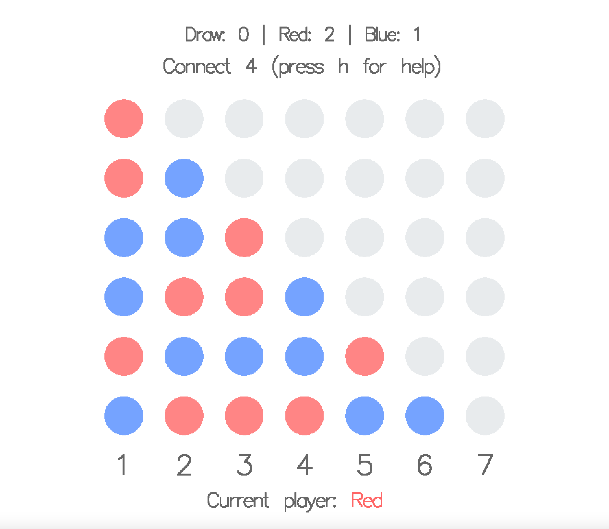

# connect-more

Variation of the popular two-player board game Connect Four, implemented in Haskell using Gloss.

## Building/Running

With GHC, cabal and stack installed, the library can be built by running `stack build` in a Terminal window.

The game can then be run locally using the command: `stack run`.

## Gameplay 

The gameplay follows that of the original game, wherein players take turns adding a circular piece to an unfilled column in the board, until one player wins by getting the chosen number of pieces of the same colour in a row (vertically, horizontally or diagonally); or until the board is filled, in which case a draw is declared.

The main extension to the original game is the ability to choose the **dimensions of the board** (each side limited to between 3 and 9 pieces) as well as the **number of pieces in a row** required to win (limited to between 3 and the minimum out of the number of rows and columns), via the settings menu&mdash;hence the name of my version of the game.

Another desirable feature is the alternation of the starting players; if Red starts one game, Blue will start the next, in accordance with the original game.

## Controls (keyboard)

- s: settings
- h: show/hide help menu
- q: quit to main menu, reset score
- numbers 1-number of columns: add piece to column
- left arrow key: undo previous move
- spacebar: start new game (with default settings if on main menu)

